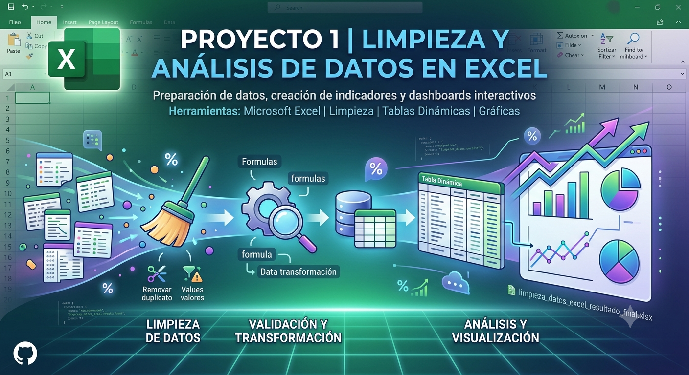

# Proyecto 1 | Limpieza y Análisis de Datos en Excel

## 📌 Descripción del proyecto

Proyecto enfocado en la preparación y análisis de datos utilizando Excel. Se realizó un proceso de limpieza de información, validación de calidad de datos y creación de reportes mediante tablas dinámicas y visualizaciones.

Este repositorio contiene el archivo final con la base procesada, tablas dinámicas y gráficas generadas durante el análisis.

## 🎯 Objetivo

Preparar una base de datos para análisis mediante la identificación de inconsistencias, limpieza de información y generación de indicadores que permitan obtener insights a partir de los datos.

## 🛠️ Herramientas utilizadas

* Microsoft Excel
* Limpieza de datos
* Tablas dinámicas
* Gráficas
* Fórmulas de transformación

## 🔎 Proceso realizado

* Revisión inicial de la estructura de la base de datos.
* Identificación de registros duplicados.
* Validación de valores faltantes.
* Limpieza y estandarización de información.
* Unificación y corrección del formato de fechas.
* Cálculo de métricas descriptivas.
* Creación de tablas dinámicas para análisis.
* Elaboración de gráficas para presentación de resultados.

## 📊 Análisis realizado

Durante el análisis se evaluaron diferentes indicadores, incluyendo:

* Revisión de duplicados en la información.
* Cálculo de promedios y métricas generales.
* Análisis mediante tablas dinámicas.
* Visualización de tendencias y resultados.

## 🧮 Fórmulas y herramientas utilizadas

Se aplicaron funciones de Excel para transformación y análisis de datos, incluyendo:

* Funciones de fecha para estandarizar formatos.
* Funciones estadísticas para obtener promedios.
* Herramientas de limpieza y organización de datos.
* Tablas dinámicas para resumir información.

## 📁 Archivo incluido

`limpieza_datos_excel_resultado_final.xlsx`

 

Contiene la base limpia, tablas dinámicas y visualizaciones generadas durante el análisis.

## 💡 Aprendizajes

Este proyecto permitió desarrollar fundamentos de análisis de datos, enfocándose en la importancia de la calidad de la información, la limpieza de bases de datos y la comunicación de resultados mediante visualizaciones.
